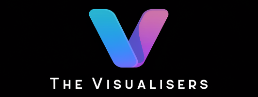

# Team Manifesto: The Visualisers

**Slogan**: *"Turning ideas into captivating realities, one pixel at a time."*

## Members and Skills
- **Lana**: Front-end Engineer, UI/UX, User-Centred Design  
- **Dionne**: Project Manager, UI/UX Design, Full Stack  
- **Aaron**: Front-end Engineer, UI/UX, User-Centred Design  
- **Luisde**: CSS, Front-end Engineer, HTML, AI, Project Manager  

## Decision Making
- **Dot Voting**: We use dot voting for decision-making, ensuring that every voice is heard and we make fair, collective choices.

## Team Values
1. **No Judgement**: We create a safe space where all ideas are respected.
2. **Empathy**: We actively listen to and support each other.
3. **Inclusivity**: Our team embraces diverse perspectives and backgrounds.
4. **Learning Experience for All**: We approach the project as a chance to grow and develop our skills together.
5. **Effective Communication**: We regularly check in with each other to ensure alignment and transparency.
6. **Realism with Limitations**: We dream big, but remain practical within our scope (Dream Room mindset).

## Tools
- **Slack**: For daily communication.
- **Zoom**: For virtual meetings and collaboration.

## Meeting Schedule
- **Daily Stand-Ups**: Every morning to review progress and set goals.
- **Additional Meetings**:  
  - Dionne: Tuesday and Thursday afternoons  
  - Lana: Thursday afternoons  
  - Aaron: Ad-hoc based on availability  

## Expectations
- **Lana**: Showcase a strong UI for her portfolio.
- **Dionne**: Build a solid project to enhance her portfolio and deepen knowledge.
- **Aaron**: Foster a collaborative environment where each member contributes equally.
- **Luisde**: Master API calls and craft a flawless front-end experience.

## Handling Conflict Constructively
- **Step 1**: Don't be stubborn about individual ideas; keep an open mind.
- **Step 2**: Stick to decisions made through dot voting, even if you disagree.
- **Step 3**: Remember the goal—it's not just about the project, it's about the learning experience.

## Roles and Responsibilities
- **Dionne**: Project Manager, UI/UX Design, Full Stack  
- **Lana**: Front-end Engineer, UI/UX, User-Centred Design  
- **Aaron**: Front-end Engineer, UI/UX, User-Centred Design  
- **Luisde**: Project Manager, AI Integration, Front-end Engineer  
